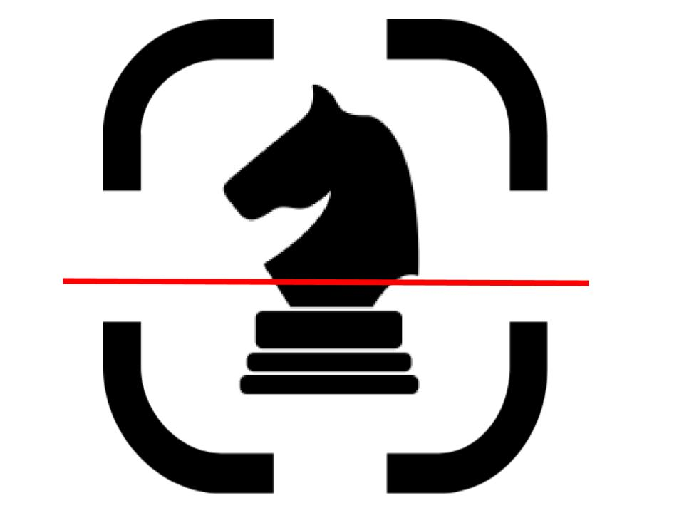
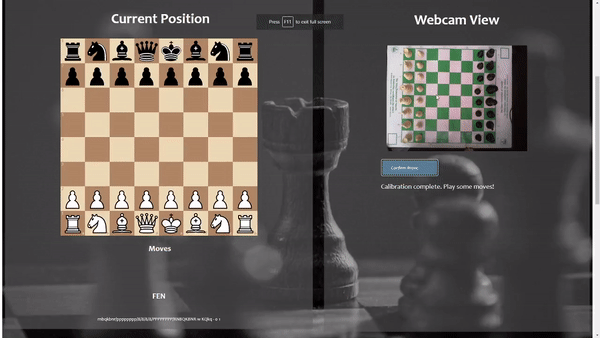

<!--
*** Thanks for checking out the Best-README-Template. If you have a suggestion
*** that would make this better, please fork the repo and create a pull request
*** or simply open an issue with the tag "enhancement".
*** Thanks again! Now go create something AMAZING! :D
***
***
***
*** To avoid retyping too much info. Do a search and replace for the following:
*** github_username, repo_name, twitter_handle, email, project_title, project_description
-->


<!-- PROJECT SHIELDS -->
<!--
*** I'm using markdown "reference style" links for readability.
*** Reference links are enclosed in brackets [ ] instead of parentheses ( ).
*** See the bottom of this document for the declaration of the reference variables
*** for contributors-url, forks-url, etc. This is an optional, concise syntax you may use.
*** https://www.markdownguide.org/basic-syntax/#reference-style-links
-->

<!-- PROJECT LOGO -->
<br />
<p align="center">
  <a href="https://github.com/github_username/repo_name">
    
  </a>

  <h3 align="center">ScanChess</h3>

  <p align="center">
    A computer vision web app to track over the board chess moves!
    <br />
    <a href="https://www.youtube.com/watch?v=vYw5ZPOheKw">View Demo Video</a>
  </p>
</p>


<!-- TABLE OF CONTENTS -->
<details open="open">
  <summary><h2 style="display: inline-block">Table of Contents</h2></summary>
  <ol>
    <li>
      <a href="#about-the-project">About The Project</a>
      <ul>
        <li><a href="#built-with">Built With</a></li>
      </ul>
    </li>
    <li>
      <a href="#getting-started">Getting Started</a>
      <ul>
        <li><a href="#prerequisites">Prerequisites</a></li>
        <li><a href="#installation">Installation</a></li>
      </ul>
    </li>
    <li><a href="#usage">Usage</a></li>
    <li><a href="#contact">Contact</a></li>
    <li><a href="#acknowledgements">Acknowledgements</a></li>
  </ol>
</details>


<!-- ABOUT THE PROJECT -->
## About The Project


                                                                        
Chess is a game of studying. To improve, one must always record their games for analysis. However, for casual chess players, recording chess moves on pen and paper may seem tedious and distracting. Alternatively, DGT boards used in top-level tournaments are expensive and impractical for casual chess matches. ScanChess allows users to track over-the-board chess moves with nothing more than a simple webcam and tripod.

With ScanChess, you can:

-  See a digital replica of your game on the app
-  Get the moves of your game in pgn notation
-  Get the current FEN of your position

ScanChess is a great way to record your games for later analysis and improve as a chess player!

### Built With

* [React](https://reactjs.org/)
* [Python](https://www.python.org/)
* [Tensorflow](https://www.tensorflow.org/)
* [Flask](https://flask.palletsprojects.com/en/2.0.x/)
* [OpenCV](https://opencv.org/)


<!-- GETTING STARTED -->
## Getting Started

Instructions will be posted shortly
### Prerequisites

#### Backend
* NumPy
* OpenCV
* Tensorflow
* Flask
* io
* base64
* python-chess

#### Frontend
* ChessboardJSX
* react-webcam

#### Hardware
* Webcam
* Tripod (or any other way to mount the webcam)

### Installation

```git clone https://github.com/brian386/ScanChess.git```

### Start the app
In the directory named "frontend", run:
<br/>
```npm start```
<br/>
In the directory named "Backend", run:
<br/>
```python api.py```

<!-- USAGE EXAMPLES -->
## Usage

See full demo video <a href="https://www.youtube.com/watch?v=vYw5ZPOheKw"> here </a>: 
<br/> <br/>

<strong> Note: Due to a lack of training images, the ScanChess app works only on chess sets similar to the one shown in the demo video: black and white chess pieces with green and white chess board. </strong>

1. Set up your webcam to capture an overhead view of the chess board.
2. Make sure the chess board is empty, and press "Calibrate".
3. Set up the chess pieces and press "Calibrate" again to complete the calibration.
4. Play a chess move. Press "Confirm Move" once the chess move has been made.
5. The digital chess board should update accordingly. 
6. Continue playing the game until checkmate or stalemate. Remember to press "Confirm Move" after every move.
7. Watch the game unfold on the digital chess board, copy the pgn notation for your records, or plug the FEN position into an engine to analyze the game!


<!-- CONTACT -->
## Contact

Feel free to email me at bz88keys@gmail.com.

Project Link: [https://github.com/brian386/ScanChess](https://github.com/brian386/ScanChess)


<!-- ACKNOWLEDGEMENTS -->
## Acknowledgements

* [python-chess](https://python-chess.readthedocs.io/en/latest/)
* [ChessboardJSX](https://chessboardjsx.com/)


 
